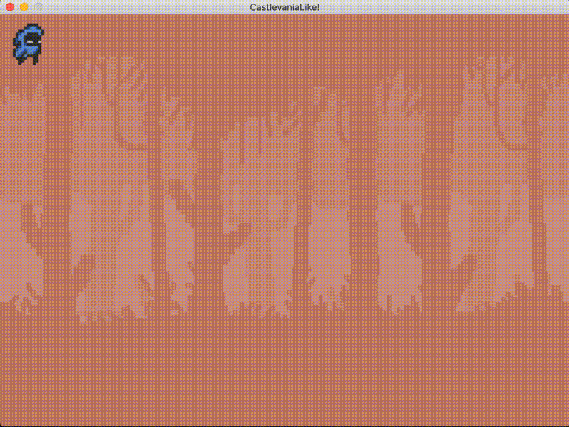

# A Castlevania-like game in GO langage

I have two goals right now, making a video game with my best friend and learning a new language. So I decided to do both at the same time! I'm learning [GO](https://golang.org/) by making a video game.

This game relies on the [SDL development library](https://www.libsdl.org/index.php) and its great [binding for GO](https://github.com/veandco/go-sdl2).

I upload here a gif to highlight the progress of the project.
 

TODO list:
- [x] Background
- [x] Draw a character
- [x] Design Pattern: User Interface
- [x] Design Pattern: Game State
- [x] Class for characters (Persona)
- [ ] Animations (In Progress!)
  - [x] Idle
  - [x] Running
  - [x] Flipping left when running left
  - [ ] Jumping
- [ ] Handle more Persona (Enemies)
- [ ] Create a level 
- [ ] Load the map from a file
- [ ] Handle Collision 
- [ ] Walk on a floor with collision!
- [ ] ...


## Assets Credits
- Assets used for this game: https://o-lobster.itch.io/platformmetroidvania-pixel-art-asset-pack
- email: caio.cesar222@gmail.com
- https://o-lobster.itch.io/


## Tutorials

Python and Patterns tuto:
https://www.patternsgameprog.com/series/discover-python-and-patterns/

Games assets:
https://itch.io/game-assets

Go Tuto Youtube: https://www.youtube.com/playlist?list=PLDZujg-VgQlZUy1iCqBbe5faZLMkA3g2x

Game Development in the Go Programming Language:
https://gamefromscratch.com/game-development-in-the-go-programming-language/

Game tuto (C++) avec bonnes animations & explications:
https://www.youtube.com/watch?v=BySDfVNljG8&list=PL6xSOsbVA1eb_QqMTTcql_3PdOiE928up


## Ressources

- SDL2: [link](https://www.libsdl.org/index.php)
- GO-SDL2: [link](https://github.com/veandco/go-sdl2)
- Compiler Explorer: https://godbolt.org/
- Tutorial GO very cool: https://tutorialedge.net/course/golang/
- Profiling: https://pkg.go.dev/runtime/pprof

## Patter Designs

Video game programming principles: 
https://www.code4projects.net/video-game-programming-principles/

Game Programming Pattern - Robert Nsytrom : https://gameprogrammingpatterns.com/contents.html

## mov to gif

https://gist.github.com/dergachev/4627207

https://superuser.com/questions/436056/how-can-i-get-ffmpeg-to-convert-a-mov-to-a-gif
https://imagemagick.org/script/download.php#macosx

## Install on Windows

### Check CPU architecture 

```bash
uname -m
```

### Install Mingw-builds using chocolatey

```bash
> choco install mingw

> choco info mingw
Chocolatey v0.10.15
mingw 11.2.0 [Approved]
```

Then install SDL2, SDL2_image, SDL2_mix, SDL_ttf following GO-SDL2 instructions inside:
```
    installpath\chocolatey\lib\mingw\tools\install\mingw64\x86_64-w64-mingw32\
```

